# Cinematix
[](https://github.com/bryankeane0/movie-app-v2/actions/workflows/node.js.yml)
> By Bryan Keane

## Overview.

This is a react project which utilizes the TMDB API to provide a website for film and television fanatics where the user can view various movies, tv shows, and actors

### Features.
+ Basic sign up and login authentication via JWT tokens
+ Discover Movies and TV Shows pages
+ Upcoming Movies page 
+ Top Rated TV Shows page
+ Popular Actors and Latest Actors pages
+ Custom, responsive MUI Design
+ Generalised component design, using one custom component instead of 3. Example: templateCard instead of actorCard, movieCard and showCard
+ CI/CD Pipeline on repository
+ Pagination
+ Custom API Routes 

## Installation Requirements
Installing the software

```
git clone https://github.com/bryankeane0/movie-app-v2.git OR git@github.com:bryankeane0/movie-app-v2.git
```

followed by installation from the root directory

```bat
npm install
```

## API Configuration

```bat
REACT_APP_TMDB_KEY=<tmdb_key>
FAST_REFRESH=false
NODE_ENV=development
PORT=8080
HOST=<host>
SECRET=<jwt_secret>
SEED_DB=True
mongoDB=<mongo_cluster_url>
```

## API endpoints - Same endpoints for react app and custom API
+ Discover list of movies - /movies/discover
+ Discover list of upcoming movies - /movies/upcoming
+ Movie details - movie/:id
+ Discover list of tv shows - /tv/discover
+ Discover list of top rated tv shows - /tv/toprated
+ TV Show details - tv/:id
+ Discover list of popular actors - /actors/popular
+ Discover list of latest actors - /actors/latest
+ Actor details - actor/:id
+ Login - /login
+ Signup - /signup

## App Design.

### Storybook Components.

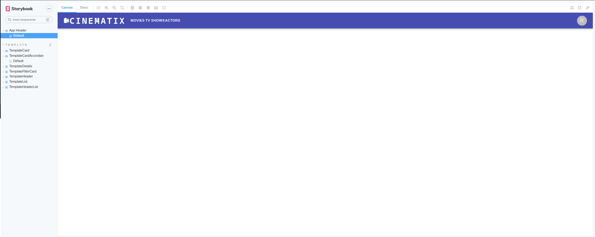
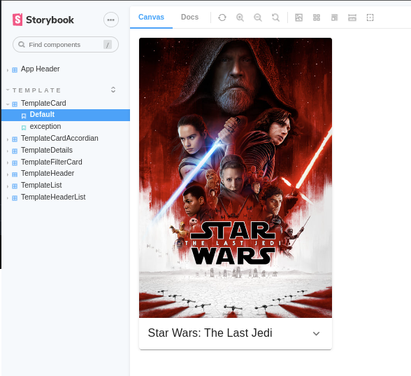
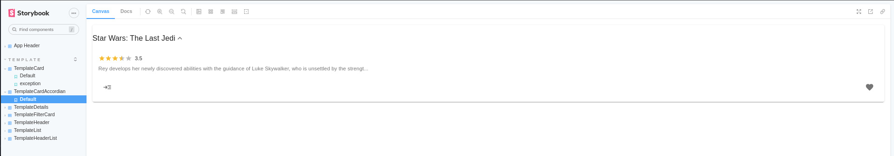
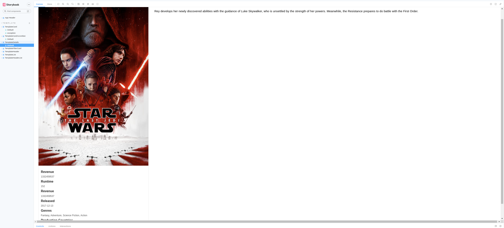
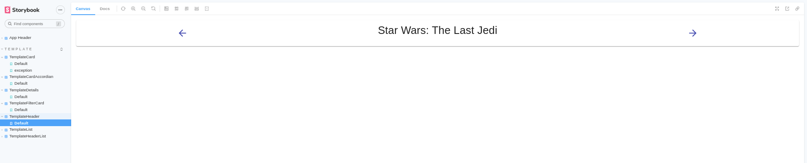
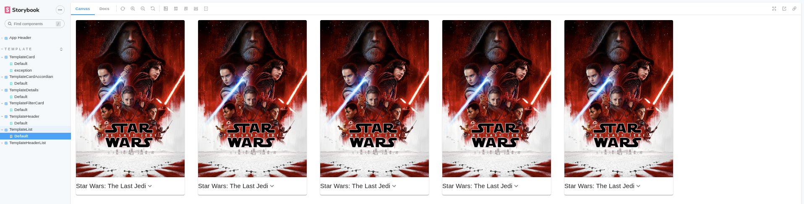
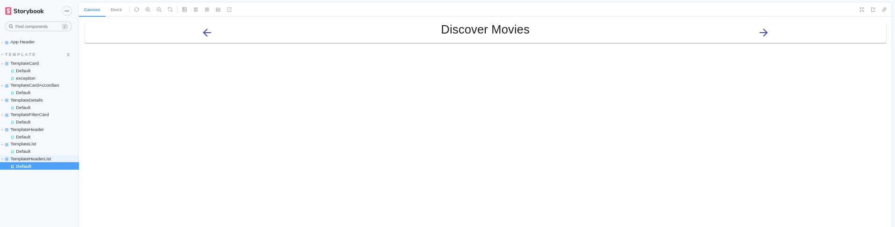

### UI Design.

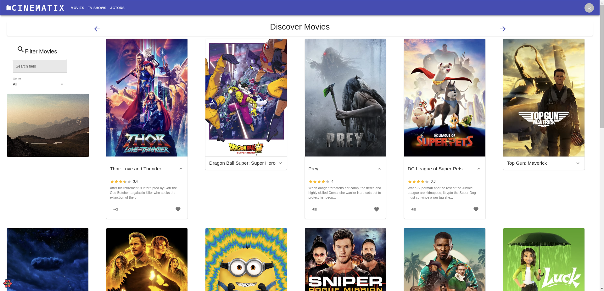
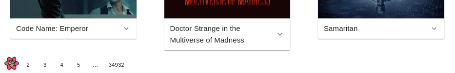
>Shows a list of movies with pagination available at the bottom. Users can navigate and discover movies, add them to favourites. A MUI accordian dropdown is available to show more info and allow the user to go into movie details

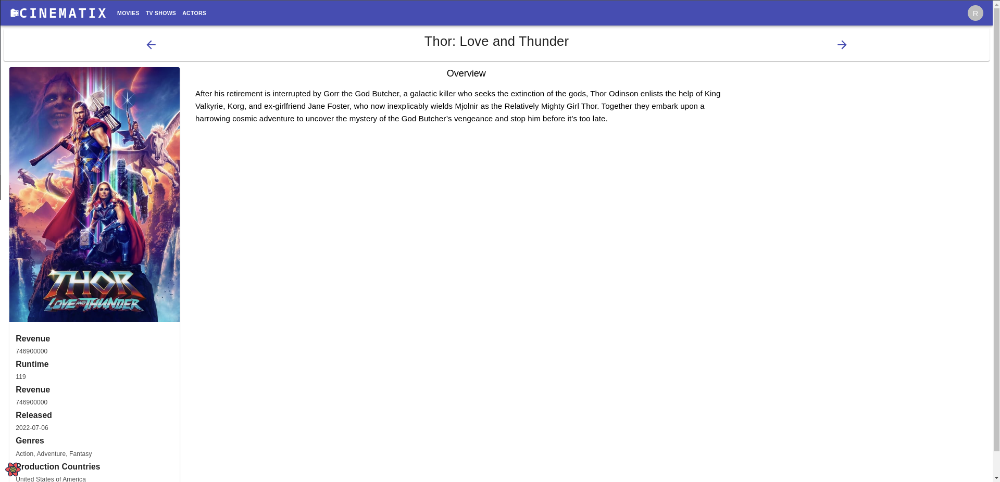
> Movie details

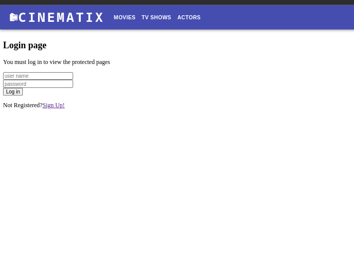
> Sign in page
 

> Example actor card

> The other pages are relatively the same as they use similarly designed components with different details and showing other information for tvshows and actors. This can be seen when deploying the app


## Independent learning (If relevant).

 - I would say the extent I added MUI components to the front end would be independant learning as I utilised a lot of components not used or mentioned throughout the course using the MUI docs.
 - I would also like to mention the use of GitHub and the CI/CD pipeline to run code checks and build and deploy the app automatically would also be independant learning as it made development of the app more streamlined.

## API Design

> API design is reflected in the same endpoints developed for the react app in `/discover/movies`, `/tv/toprated`, `/actors/popoular` for GETs and the basic GETS POSTS and PUTS from the basic API development from the labs
> Please see about for the available gets although they are not integreated into the react app, they function with postman


## Security and Authentication
- Basic JWT Authentication
